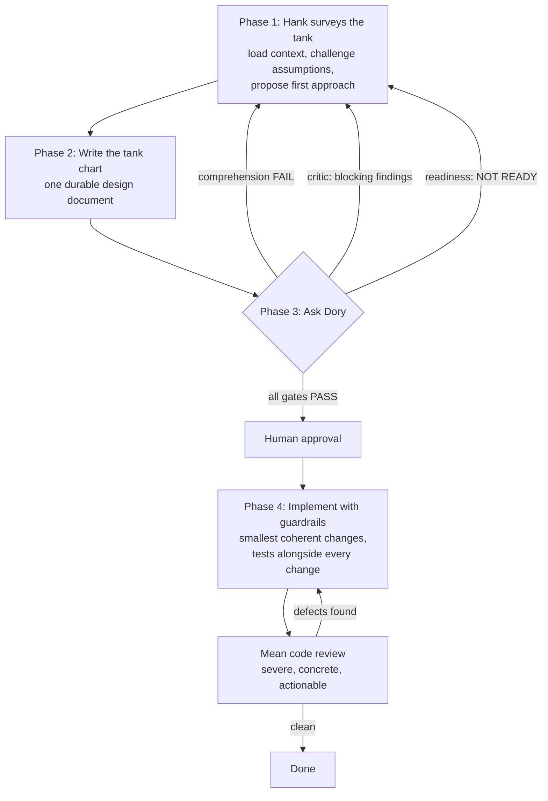

# HankNDory

**A structured design-validate-implement method for building software with an AI coding agent, named for two Pixar characters: Dory, from *Finding Nemo*, and Hank, from its sequel, *Finding Dory*.**

HankNDory is an **[Agent Skill](https://agentskills.io/specification)**: a `SKILL.md` file (plus supporting reference material) that an AI coding agent loads and follows as an explicit workflow, instead of designing and coding a feature in one continuous, memory-biased conversation. It exists to stop a common failure mode of AI-assisted development: an agent (and the human driving it) becoming anchored to unstated assumptions that only ever lived in one long chat, producing a design that looks solid in the room but falls apart the moment someone (or something) reads it cold.

Because it follows the open Agent Skills standard rather than a vendor-specific format, it works unmodified across GitHub Copilot, Claude, Codex, Pi, OMP, DeepSeek Harness, OpenCode, Antigravity, and any other compliant agent. See [Installing the skill](#installing-the-skill) below.

## The problem this solves

When you design and implement a feature in one sitting with an AI agent, the agent's understanding of *why* each decision was made lives only in that conversation's context. Nothing forces the design to be written down completely enough to survive outside it. Gaps get papered over by continuity ("we already covered that") rather than caught, and by the time the flaw surfaces (in code review, in production, or in a teammate's confused questions), the reasoning that would explain or fix it is gone.

HankNDory forces a hard separation between **designing with full context** and **validating with none**, so that the design document itself, not the conversation that produced it, has to carry the full weight of the plan.

## The two characters

The skill is named after two fish (well, one fish and one octopus): Dory, who debuted in *Finding Nemo*, and Hank, the septopus who appears in its sequel, *Finding Dory*, each lending their defining trait to one half of the method:

### Hank, the design phase

Hank is the wary, context-rich phase where a feature is actually designed. In this phase, the agent:

- inspects the real repository (existing code, architecture, tests, conventions) before proposing anything;
- proposes an initial technical approach itself, rather than waiting to be told one, to test its own understanding and avoid anchoring on the user's first idea;
- challenges assumptions, asks hard questions, and argues against a design that is merely agreeable rather than sound;
- refuses to let a single line of production code be written until the plan is validated;
- writes everything down into one durable design document: problem, goals, current system, architecture, alternatives considered and rejected, detailed file-by-file implementation plan, risks, rollout.

Hank plans like his freedom depends on it: nothing proceeds until the plan accounts for failure modes, edge cases, and the messy reality of the existing system.

### Dory, the validation phase(s)

Dory is the opposite of Hank by design: she has **no memory of the Hank conversation at all**. Every Dory phase must run in a genuinely separate session (never a continuation of the design conversation) because a single ongoing conversation cannot honestly certify its own amnesia. A Dory phase is handed nothing but the design document and the files it explicitly references, and must succeed or fail using only that.

There are three independent Dory checks, each a hard gate:

| Dory phase | Question it answers |
|---|---|
| **Comprehension** | Can a reader with zero prior context explain the problem, the current system, the proposed solution, and the files that will change, using only the document? Does that explanation still hold up once rewritten in the plainest possible language, with nothing invented or lost? |
| **Critic** | Does the design have faulty assumptions, missing edge cases, contract or lifecycle gaps, or unresolved risks, reviewed adversarially? |
| **Readiness** | Does the document contain everything an implementer needs to build it correctly on the first pass, with no outstanding material questions? |

If any Dory phase fails, work returns to Hank to fix the document, never to patch understanding verbally and move on. Only after every gate passes, and a human explicitly approves, does implementation begin.

## The full lifecycle



1. **Phase 1: Hank surveys the tank.** Load and verify real repository context, enforce a strict no-code rule during discovery, apply an explicit "sycophant challenge" (state the strongest counter-argument, find the weakest evidence), then propose a first technical approach before asking the user for one.
2. **Phase 2: Write the tank chart.** Turn the discussion into one markdown design document, built section by section from a fixed template (`reference/design-doc-template.md`) covering problem, goals, current system, architecture, alternatives considered, detailed implementation, risks, rollout, and a running `Dory validation record`. Before handing off to Dory, Hank runs a plain-speech pass over the prose sections against `reference/plain-speech-checklist.md`.
3. **Phase 3: Ask Dory.** Run comprehension, critic, and readiness checks in isolated sessions, each against the document alone. Any failure sends the work back to Hank with a specific, actionable gap list.
4. **Phase 4: Implement with guardrails.** Only after human approval: implement the smallest coherent units from the approved plan, with tests alongside every change, stopping immediately if reality contradicts the design rather than improvising around it. Finish with a severe but constructive "mean" code review against the approved design.

A **bootstrap-context** mode is also available for onboarding an existing, under-documented codebase: it recursively generates and rolls up `README.md` files from the leaves of the source tree upward, so a later Hank phase has real material to load instead of starting cold.

## Operating modes

| Mode | Purpose |
|---|---|
| `new-feature-hank` | Co-design a new feature and produce or improve its design document. |
| `dory-comprehension` | Test whether a fresh reader can understand the feature from the document alone, including a plain-language rewrite check. |
| `dory-critic` | Adversarially review the design for omissions, faulty assumptions, and risk. |
| `dory-readiness` | Decide whether the document is sufficient for a correct first-pass implementation. |
| `implementation` | Implement strictly from an approved, validated design document. |
| `mean-review` | Perform a severe, actionable code review against the approved design. |
| `bootstrap-context` | Build a hierarchy of repository README files via bottom-up summarization. |
| `full-voyage` | Orchestrate every phase above, in order, end to end. |

Trivial, low-risk changes (a copy fix, a log line, an isolated one-file bug fix) can skip straight to a direct edit plus tests. The skill explicitly defines what counts as trivial versus standard, and always classifies as standard anything touching public APIs, schemas, auth, migrations, billing, security boundaries, or cross-team contracts.

## Installing the skill

The entire skill lives in the [`hankndory/`](./hankndory) folder of this repository. Every agent below loads a skill the same way: the folder is copied (or symlinked) into that agent's skills directory, keeping the folder itself named `hankndory`, matching the `name:` field in its frontmatter, as the Agent Skills spec requires.

### Quick install (GitHub CLI)

If you have [GitHub CLI](https://cli.github.com/) 2.90.0 or later, this installs into the correct directory for whichever host you run it from, automatically:

```sh
gh skill install ajaxdude/HankNDory
```

Pass `--agent <host> --scope <user|project>` to target a specific agent/location instead of the interactive prompt, e.g. `gh skill install ajaxdude/HankNDory --agent claude-code --scope user`.

### Manual install, by agent

| Agent | Personal (all projects) | Project (this repo only) |
|---|---|---|
| **GitHub Copilot / Copilot CLI** | `~/.copilot/skills/hankndory/` or `~/.agents/skills/hankndory/` | `.github/skills/hankndory/`, `.claude/skills/hankndory/`, or `.agents/skills/hankndory/` |
| **Claude / Claude Code** | `~/.claude/skills/hankndory/` | `.claude/skills/hankndory/` |
| **Codex (ChatGPT & Codex CLI)** | `~/.codex/skills/hankndory/` | `.codex/skills/hankndory/` |
| **Pi** | `~/.pi/agent/skills/hankndory/` or `~/.agents/skills/hankndory/` | `.pi/skills/hankndory/` or `.agents/skills/hankndory/` |
| **OMP** | Reads Claude-compatible skills directly. Install the same way as Claude Code, above | same as Claude Code, above |
| **DeepSeek Harness (`dsh`)** | `~/.dsh/skills/hankndory/` or `~/.agents/skills/hankndory/` | `.dsh/skills/hankndory/` or `.agents/skills/hankndory/` |
| **OpenCode** | `~/.config/opencode/skills/hankndory/`, `~/.claude/skills/hankndory/`, or `~/.agents/skills/hankndory/` | `.opencode/skills/hankndory/`, `.claude/skills/hankndory/`, or `.agents/skills/hankndory/` |
| **Antigravity** | `~/.gemini/config/skills/hankndory/` | `.agents/skills/hankndory/` (default) or `.antigravity/skills/hankndory/` |

Two things fall out of this table worth calling out directly:

- **`~/.agents/skills/` (personal) and `.agents/skills/` (project) are a shared, tool-agnostic convention** that several of these agents read directly: Copilot, Pi, OpenCode, Antigravity, and DeepSeek Harness. Installing HankNDory there once can cover multiple agents at once instead of duplicating the folder per tool.
- **DeepSeek Harness** (`dsh`, [deepseek-ai/deepseek-harness](https://github.com/deepseek-ai/deepseek-harness)) discovers skills through its `skill-filesystem` provider, which requires the same one-level `<name>/SKILL.md` layout this repository already uses. No restructuring needed. Its own docs note the project is in developer preview with compatibility-breaking changes expected, so these paths may shift.
- **"OMP"** isn't yet an independently-documented Agent Skills client as of this writing; it's listed here because it's known to read Claude-compatible skills/plugins without requiring Claude Code itself. If it refers to something more specific, the fallback is the same either way: any client that follows the Agent Skills spec will find HankNDory wherever it expects skills to live, since the format itself is what's portable.

Once installed, the skill is discovered by its frontmatter `name` (`hankndory`) and `description`, so it activates automatically whenever a request matches, or it can be invoked explicitly, e.g. *"use HankNDory to design the new export feature."*

## Repository layout

```
HankNDory/
├── LICENSE
├── README.md
└── hankndory/
    ├── SKILL.md
    ├── agents/
    │   └── ui_metadata.yaml
    └── reference/
        ├── design-doc-template.md
        └── plain-speech-checklist.md
```

- **`hankndory/SKILL.md`**: the method itself, covering rules, modes, the four-phase lifecycle, the design document structure, and the failure-recovery guidance the agent follows.
- **`hankndory/agents/ui_metadata.yaml`**: display metadata (name, one-line description) used by tooling that surfaces installed skills in a UI.
- **`hankndory/reference/design-doc-template.md`**: the canonical starting template for every design document the Hank phase produces, with per-section guidance comments.
- **`hankndory/reference/plain-speech-checklist.md`**: the checklist Hank applies to prose sections at the end of Phase 2, adapted from the [unslop](https://github.com/cursor/plugins/blob/main/pstack/skills/unslop/SKILL.md) skill for design-document writing.
- **`hankndory/`** is deliberately nested one level below the repository root (rather than living at the root itself) because `gh skill` and several other skill-discovery tools only scan for `*/SKILL.md`, not a `SKILL.md` at the very top of a repository.

## Why this matters in practice

The method's core discipline is simple to state and easy to skip under time pressure: **a design is not done because the room agrees on it; it is done because a stranger with no memory of the room can read it and build the right thing.** Hank brings the context and the caution. Dory brings the amnesia that keeps everyone honest.

## License

[MIT](./LICENSE). © 2026 ajaxdude. Use, copy, modify, and redistribute freely, including in commercial and closed-source projects, provided the copyright notice is retained.
