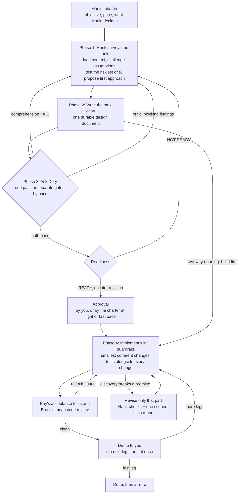

# HankNDory

**A structured design-validate-implement method for building software with AI coding agents, named for Pixar characters: Dory, Marlin, Crush, Bruce, and Mr. Ray, from *Finding Nemo*, and Hank and Bailey, from its sequel, *Finding Dory*.**

This is version 2.10. [CHANGELOG.md](./CHANGELOG.md) lists what changed in each version.

HankNDory is an **[Agent Skill](https://agentskills.io/specification)**: a `SKILL.md` file (plus supporting reference material) that an AI coding agent loads and follows as an explicit workflow, instead of designing and coding a feature in one continuous, memory-biased conversation. It exists to stop a common failure mode of AI-assisted development: an agent (and the human driving it) becoming anchored to unstated assumptions that only ever lived in one long chat, producing a design that looks solid in the room but falls apart the moment someone (or something) reads it cold.

Because it follows the open Agent Skills standard rather than a vendor-specific format, it works unmodified across GitHub Copilot, Claude, Codex, Pi, OMP, DeepSeek Harness, OpenCode, Antigravity, and any other compliant agent. See [Installing the skill](#installing-the-skill) below.

## The problem this solves

When you design and implement a feature in one sitting with an AI agent, the agent's understanding of *why* each decision was made lives only in that conversation's context. Nothing forces the design to be written down completely enough to survive outside it. Gaps get papered over by continuity ("we already covered that") rather than caught, and by the time the flaw surfaces (in code review, in production, or in a teammate's confused questions), the reasoning that would explain or fix it is gone.

HankNDory forces a hard separation between **designing with full context** and **validating with none**, so that the design document itself, not the conversation that produced it, has to carry the full weight of the plan.

## A hybrid for the age of AI

Agile avoids big up-front design because requirements change once people see working software. With AI agents the costs flip. Code is cheap, but keeping a project coherent is expensive, because agents forget everything between conversations. The design document is their memory. So HankNDory is neither waterfall nor Agile. It runs spikes before designing, overlaps building with review at fast pace, writes designs after the code at light pace, and has designs state promises instead of restating code. On top of that:

- **Two-way doors are built first.** A change that reverting its commits fully undoes, such as user-interface work, internal code, or an experiment behind a switch, is built first and written up as built. A change that is hard to undo, such as a public API, a data migration, a deletion, sign-in, or money, is designed and approved first.
- **The Map, then the legs.** Before building, the design is a Map: the problem, the goals, the promises that hold across the whole build, and the legs in order, each one line long, with only the first leg in full. Each later leg is detailed when it starts, using what the last leg taught. The Map is not the charter. The charter says how the voyage is run; the Map says what is being built.
- **A demo at every milestone.** You see working software, not only documents: what works now, how to try it, the checks that pass, the choices made, and what comes next. The next leg starts without waiting for you, unless the charter says that demo should wait for your reaction.
- **A retro when the voyage ends.** Three to six plain lines on what went well, what slowed it down, and what to change next time, including in the method itself.

### The crew

| Character | Role | What they do |
|---|---|---|
| You | Product manager | Also the executive sponsor. You own the reserved decisions and the budget. |
| Hank | Architect and engineer | The tech lead who designs and builds. |
| Dory | Reviewer and demo voice | Reviews the design cold, like a new hire reading the spec on day one, acting as both the fresh-eyes reader and the architecture review board. She is also the voice of every update and demo, in plain words, because keeping it simple keeps everyone aligned, and she explains the choices behind each demo. |
| Marlin | Scrum master | Keeps one project moving: pace, budget, the digest, unblocking work, and the retro. |
| Crush | Program manager and operations | Two jobs: platform operations (who gets the shared machines, and when) and the portfolio office (one view across all projects). |
| Bruce | Red team | Security and the mean code review, reviewing as an attacker would. |
| Bailey | Data science | Runs spikes, experiments, and measures, and writes a one-page card for each. |
| Ray | Quality assurance | Writes acceptance tests from the design's promises before seeing any of the code. |

### How it compares

| HankNDory | Agile (Scrum) | Shape Up | Waterfall | What changes with AI agents |
|---|---|---|---|---|
| Voyage | Project or release | Cycle | Project | It runs until the objective is met, not for a set number of weeks, and agents work around the clock. |
| Charter | Sprint goal and working agreement | Appetite and the bet | Project charter | It says which decisions agents make alone, so work never waits on a person for a call already handed over. |
| Pace | None | None | Governance tier | Rigor matches the risk of each part, not the team's habit. |
| The Map | Product vision and epics | Shaped pitch | Product requirements and high-level design | One document is both the requirements and the design, written down because agents forget. |
| Legs | Sprint increment | Scopes | Detailed design per phase | Each stretch is detailed when it starts, using what the last one taught. |
| Two-way door | Working software over documentation | Building inside the shaped bounds | Change control on everything | Code is cheap, so build first what is easy to undo. |
| One-way door | Architecture decision record | Shaping out the rabbit holes | Stage gate | Coherence is expensive, so design first only what is hard to undo. |
| Spike and card (Bailey) | Spike | De-risking while shaping | Feasibility study | It often takes minutes, and leaves a card the design cites. |
| Dory's review | Peer review and backlog refinement | Pitch review | Design review | The reviewer has no memory of the design talk, so the document must stand on its own. |
| Milestone | Release or increment review | End of a cycle | Phase | Each one ends in a demo. |
| Acceptance tests (Ray) | Acceptance criteria and Definition of Done | None | Test plan | Written from the promises before seeing the code, by an agent that doesn't build it. |
| Mean code review (Bruce) | Code review | None | Security audit | Every change, as an attacker would review it, at little cost. |
| Dory's update | Daily standup | Hill chart | Weekly status report | Hourly, only when something changed, in plain words. |
| LGTM, Blocked, Issues | Blockers raised at standup | Uphill or downhill | Green, red, amber | Blocked means only you can unblock it. |
| Digest | Product owner decisions | Betting table | Steering committee | Questions come together, recommendation first, and never stop the work. |
| Crush's report | Scrum of scrums | Hill charts across teams | Portfolio report | One table for every project and every shared machine. |
| Demo | Sprint review | Demo at the end of the cycle | User acceptance | At every milestone, and the next leg doesn't wait for it by default. |
| Retro | Retrospective | None (no set retro) | Lessons learned | It proposes changes to the method itself. |

## The four main characters

Dory, who debuted in *Finding Nemo*, and Hank, the septopus who appears in its sequel, *Finding Dory*, each lend their defining trait to one half of the method. Marlin, Nemo's dad, keeps the whole trip moving, and Crush, the sea turtle, keeps the shared lanes clear:

### Hank, the design phase

Hank is the wary, context-rich phase where a feature is actually designed. In this phase, the agent:

- inspects the real repository (existing code, architecture, tests, conventions) before proposing anything;
- proposes an initial technical approach itself, rather than waiting to be told one, to test its own understanding and avoid anchoring on the user's first idea;
- challenges assumptions, asks hard questions, and argues against a design that is merely agreeable rather than sound;
- runs a short, throwaway experiment first when a cheap real test can settle the riskiest assumption;
- refuses to let production code for anything hard to undo be written until the plan is validated, and builds what is easy to undo first;
- writes everything down into one durable design document: problem, goals, current system, architecture, alternatives considered and rejected, the contracts each component must keep and the build order, risks, rollout.

Hank plans like his freedom depends on it: nothing proceeds until the plan accounts for failure modes, edge cases, and the messy reality of the existing system.

### Dory, the validation phase(s)

Dory is the opposite of Hank by design: she has **no memory of the Hank conversation at all**. Every Dory phase must run in a fresh conversation with no history (never a continuation of the design conversation) because a single ongoing conversation cannot honestly certify its own amnesia. A sub-agent or a new chat in the same checkout is enough, as long as it starts with nothing from the design session. She needs a blank memory. She does not need a new copy of the repository. A Dory phase is handed nothing but the design document and the files it explicitly references, and must succeed or fail using only that.

There are three independent Dory checks, each a hard gate:

| Dory phase | Question it answers |
|---|---|
| **Comprehension** | Can a reader with zero prior context explain the problem, the current system, the proposed solution, and the parts that will change, using only the document? Does that explanation still hold up once rewritten in the plainest possible language, with nothing invented or lost? |
| **Critic** | Does the design have faulty assumptions, missing edge cases, contract or lifecycle gaps, or unresolved risks, reviewed adversarially? |
| **Readiness** | Does the document contain everything an implementer needs to build it correctly on the first pass, with no outstanding material questions? |

At careful pace, comprehension and critic run at the same time, both reading the same commit of the document, because neither needs the other's result, and readiness runs last, once both have passed. At faster paces one reviewer runs them in one pass, as the pace table below shows. Before a batch reviews a new version, Hank runs his own checks on it once: a mechanical scan and, once there is an earlier reviewed commit to compare with, a diff check that asks whether the revision fixed what it was meant to fix, brought back an old defect, contradicted unchanged text, or quietly changed an obligation. He fixes what they find, then starts the batch, to keep mistakes a fix just added away from reviewers.

A critic round with no blocking findings passes, and its important findings are fixed once, without another round. A design gets two or three critic rounds in its whole life, by pace, including any after building starts, plus one for each later leg that is hard to undo (two at careful pace), and more need the user's OK.

If any Dory phase fails, work returns to Hank to fix the document, never to patch understanding verbally and move on. Building anything hard to undo begins only after the gates pass, and you approve, or the charter does at light or fast pace.

### Marlin, the one who keeps swimming

Marlin crossed an ocean to find Nemo and never stopped to wait. In the method, Marlin is a role the main conversation plays, and Nemo is the final objective. At kickoff, you and Marlin write a short **charter**: the final objective, milestones, deadline, budget (in agent-hours, counting every agent that runs, or in cost), pace, which decisions Marlin makes alone, which ones stay with you, any wording or small extension you accept as built, where Marlin backs up the work, where Dory's update goes, and how long a reversible question waits before Marlin takes its default (10 minutes unless you set another). After that, Marlin:

- decides what the charter hands over, and records it;
- sends you one **digest** at a time, holding every question and every piece of news. Each question leads with a recommendation, then two to four plain sentences on what it is, why it needs deciding now, and what each option costs you in time, money, or risk, and, where it can be undone, a default and when it takes effect;
- sends or posts **Dory's update**, a table of the status (LGTM, meaning looks good to me, Blocked, or Issues), what was just done, what is happening now in each piece of work, what comes next, and about how much is done with when it should finish, only when there is new progress; it checks every hour. It names anything waiting on you, and why. It is written for someone who remembers nothing: plain words, no document numbers, review numbers, step codes, or hashes;
- at every pace, starts at once everything the charter and your approvals already allow. Independent work runs side by side in several sub-agents or sessions: research, drafts, tests, reviews, and building inside approved designs. Only the work that depends on one of your answers waits for it. By default, at most three helpers or reviewers run at once, every helper runs on a much cheaper model than Hank and the review gates, nothing checks on running work more than once an hour, and a conversation that grows past about 300,000 tokens hands off to a fresh one (`reference/cost.md`). At each check-in, Marlin makes sure nothing allowed sits idle beyond the cap below;
- sends you a demo at every milestone, and a retro when the voyage ends;
- tells you early when the deadline or budget is at risk, and never recommends another review round when nothing is blocking;
- pushes the designs, the charter, their history files, and the working branches to a backup remote at every gate, so losing a machine loses nothing. If the project's repository is public or isn't yours, use a private one.

### Crush, who knows every lane

Crush is the sea turtle who rides the current. In the method, Crush is one long-running conversation for all your projects, not part of any one of them. The skill creates it the first time a voyage starts, as its own top-level conversation detached from every voyage, and every later voyage finds and uses the same one. It asks you to approve its house rules, and until you do it only queues heavy work one job at a time and gathers updates. It does two jobs:

- **It routes heavy work onto the machines you share across projects.** Sessions ask Crush for machine time before loading a model, running a GPU job, or running a big memory, disk, or CPU job; light work like git and small tests doesn't. Crush runs as much side by side as fits, so the machines stay busy without collisions. You set its house rules: the limits it keeps, what it may do alone (such as pausing and restoring shared services, or moving files between drives), what stays yours (such as installing software, stopping a running job, or deleting anything), and a freeze switch for model loading and GPU work when you need a machine yourself. A grant gives machine time only, never permission.
- **It gathers every project's updates into one report.** Dory is the voice of each project's update table, which a project writes only when it has new progress; waiting is not progress. By default each project sends its update to Crush instead of posting its own table. Once an hour, at a time you set in its house rules (about five past by default), and only when something is new, Crush posts one report, never in between: everything still waiting on you first, across all projects, new items marked, each listed once with plain context, how long it has waited, and a link to where you act on it; then a row for each project with news, including its status and about how much is done and when it should finish; then a line for each machine where something changed. So Crush's report is the one place you read updates. Items that are only still waiting don't trigger a report, but you can ask Crush for the current list at any time. A project that is only waiting gets no reminder. One with work running and no update for 3 hours gets one, answers it in a line, and is marked as possibly stalled if it doesn't answer within an hour.

The charter also sets the **pace**:

| Pace | Dory review | Approval before building |
|---|---|---|
| **Light** | for a point release or a design written after the code: one fresh reviewer runs every gate in one pass, Hank fixes everything it found once, design and code, and checks the fix; a second pass runs only if the first had a blocking finding, a failed comprehension test, or a not-ready verdict; one code review plus one re-review; needs a design-review budget cap | the charter approves the fixed version once the last pass had none of those |
| **Fast** | one fresh reviewer runs every gate in one pass; two critic rounds in the design's life; building overlaps review | the charter approves a `READY` design that stays inside it |
| **Balanced** | one fresh reviewer runs comprehension, clarity, and critic, then a separate readiness check; two critic rounds | you approve, possibly through the digest |
| **Careful** | separate reviewers for each gate, as above; three critic rounds | you approve |

Anything on the skill's "Always standard" list (public APIs or schemas, auth, migrations or deletions of user or production data, billing, security boundaries, cross-team contracts) runs at careful pace unless the charter names it. Without a charter, everything runs at careful pace. At light and fast pace, reviewers run at Hank's reasoning effort unless the charter asks for more.

**Tooling note for the GitHub Copilot app:** task sub-agents there see the parent session's checkpoint titles and file list, so they can't be certified as fresh for a Dory review. Run each Dory reviewer as a new top-level session that doesn't pause for plan approval, and archive it once it returns. A sub-agent is fine for the mean code review, which doesn't need a blank memory.

## The full lifecycle



1. **Phase 1: Hank surveys the tank.** Load and verify real repository context, enforce a strict no-production-code rule during discovery, apply an explicit "sycophant challenge" (state the strongest counter-argument, find the weakest evidence), test the riskiest assumption with a short throwaway spike when a cheap test can settle it, then propose a first technical approach before asking the user for one.
2. **Phase 2: Write the tank chart.** Turn the discussion into one markdown design document, built section by section from a fixed template (`reference/design-doc-template.md`) covering problem, goals, current system, architecture, alternatives considered, detailed implementation, risks, rollout, and a one-line-per-review `Dory validation record`. The design states the promises the code must keep, such as contracts, invariants, and the build order, not the code itself, and it has a length limit. Each rule is written once and referred to by name everywhere else, and the revision and review history lives in a separate history file, while decisions and rejected alternatives stay in the design. Before handing off to Dory, Hank runs a plain-speech pass over the prose sections against `reference/plain-speech-checklist.md`.
3. **Phase 3: Ask Dory.** At careful pace, run the comprehension and critic checks at the same time, each in its own fresh conversation, both reading the same commit of the document, after one pass of Hank's own checks (`reference/hank-checks.md`), and run readiness once both pass. At balanced and fast pace, one fresh reviewer runs the gates in one pass, and fast pace skips Hank's diff check. Any failure sends the work back to Hank with a specific, actionable gap list, and Hank fixes everything from one batch in a single revision, written in a new conversation that picks up from a handoff entry in the history file, so Hank's conversation stays short through the review loop. A critic round with no blocking findings passes, and a design gets two or three critic rounds in its whole life, by pace. Every reviewer runs on a model at least as capable as Hank's. Any reviewer that runs the critic or readiness review runs at Hank's reasoning effort. A reviewer that runs only the comprehension test may run lower, but not below high or the tooling's nearest equivalent, or at Hank's effort if Hank runs below high. Hank's own checks run on the cheaper helper model.
4. **Phase 4: Implement with guardrails.** Only after approval, at light or fast pace on parts no blocking finding touches, or at once for a two-way-door leg, implement the smallest coherent units from the approved plan, with tests alongside every change. A discovery that keeps the design's promises is the implementer's call, logged in one line. One that breaks a promise revises only that part of the design, which gets Hank's checks and one scoped critic round, or a scoped pass at fast pace, instead of restarting the whole review. Finish with a severe but constructive "mean" code review against the approved design. After the first round, re-reviews read the fix diff, unless a fix touched a shared contract.

A **bootstrap-context** mode is also available for onboarding an existing, under-documented codebase: it recursively generates and rolls up `README.md` files from the leaves of the source tree upward, so a later Hank phase has real material to load instead of starting cold.

## Operating modes

| Mode | Purpose |
|---|---|
| `new-feature-hank` | Co-design a new feature and produce or improve its design document. |
| `dory-comprehension` | Test whether a fresh reader can understand the feature from the document alone, including a plain-language rewrite check. |
| `dory-critic` | Adversarially review the design for omissions, faulty assumptions, and risk. |
| `dory-readiness` | Decide whether the document is sufficient for a correct first-pass implementation. |
| `dory-pass` | At balanced, light, or fast pace, run the Dory gates the pace names in one fresh conversation. |
| `implementation` | Implement strictly from an approved, validated design document. |
| `acceptance-tests` | As Ray, write a leg's acceptance tests from the design alone. |
| `mean-review` | As Bruce, perform a severe, actionable code review against the approved design. |
| `bootstrap-context` | Build a hierarchy of repository README files via bottom-up summarization. |
| `full-voyage` | Orchestrate every phase above, in order, end to end, with Marlin keeping it moving toward the final objective. |

Not every job needs the full method. Trivial changes (a copy fix, a log line, an isolated one-file bug fix) skip straight to a direct edit plus tests and a code review. One-off operations (a download, a conversion, a test run, a publish, a one-time cleanup) get a one-page checklist and a review of any script instead. Anything touching public APIs, schemas, auth, migrations or deletions of user or production data, billing, security boundaries, or cross-team contracts always gets the full method.

## Installing the skill

The entire skill lives in the [`hankndory/`](./hankndory) folder of this repository. Every agent below loads a skill the same way: the folder is copied (or symlinked) into that agent's skills directory, keeping the folder itself named `hankndory`, matching the `name:` field in its frontmatter, as the Agent Skills spec requires.

### Quick install (GitHub CLI)

If you have [GitHub CLI](https://cli.github.com/) 2.90.0 or later, this installs into the correct directory for whichever host you run it from, automatically:

```sh
gh skill install ajaxdude/HankNDory
```

Pass `--agent <host> --scope <user|project>` to target a specific agent/location instead of the interactive prompt, e.g. `gh skill install ajaxdude/HankNDory --agent claude-code --scope user`.

Without a version, `gh skill install` installs the latest tagged release. To pin one, name it: `gh skill install ajaxdude/HankNDory hankndory@v2.10`, or pass `--pin v2.10`. `gh skill update hankndory` moves an unpinned install to the newest release and skips pinned installs unless you add `--unpin`.

### Manual install, by agent

| Agent | Personal (all projects) | Project (this repo only) |
|---|---|---|
| **GitHub Copilot / Copilot CLI** | `~/.copilot/skills/hankndory/` or `~/.agents/skills/hankndory/` | `.github/skills/hankndory/`, `.claude/skills/hankndory/`, or `.agents/skills/hankndory/` |
| **Claude / Claude Code** | `~/.claude/skills/hankndory/` | `.claude/skills/hankndory/` |
| **Codex (ChatGPT & Codex CLI)** | `~/.codex/skills/hankndory/` | `.codex/skills/hankndory/` |
| **Pi** | `~/.pi/agent/skills/hankndory/` or `~/.agents/skills/hankndory/` | `.pi/skills/hankndory/` or `.agents/skills/hankndory/` |
| **OMP** | Reads Claude-compatible skills directly. Install the same way as Claude Code, above | same as Claude Code, above |
| **DeepSeek Harness (`dsh`)** | `~/.dsh/skills/hankndory/` or `~/.agents/skills/hankndory/` | `.dsh/skills/hankndory/` or `.agents/skills/hankndory/` |
| **OpenCode** | `~/.config/opencode/skills/hankndory/`, `~/.claude/skills/hankndory/`, or `~/.agents/skills/hankndory/` | `.opencode/skills/hankndory/`, `.claude/skills/hankndory/`, or `.agents/skills/hankndory/` |
| **Antigravity** | `~/.gemini/config/skills/hankndory/` | `.agents/skills/hankndory/` (default) or `.antigravity/skills/hankndory/` |

Two things fall out of this table worth calling out directly:

- **`~/.agents/skills/` (personal) and `.agents/skills/` (project) are a shared, tool-agnostic convention** that several of these agents read directly: Copilot, Pi, OpenCode, Antigravity, and DeepSeek Harness. Installing HankNDory there once can cover multiple agents at once instead of duplicating the folder per tool.
- **DeepSeek Harness** (`dsh`, [deepseek-ai/deepseek-harness](https://github.com/deepseek-ai/deepseek-harness)) discovers skills through its `skill-filesystem` provider, which requires the same one-level `<name>/SKILL.md` layout this repository already uses. No restructuring needed. Its own docs note the project is in developer preview with compatibility-breaking changes expected, so these paths may shift.
- **"OMP"** isn't yet an independently-documented Agent Skills client as of this writing; it's listed here because it's known to read Claude-compatible skills/plugins without requiring Claude Code itself. If it refers to something more specific, the fallback is the same either way: any client that follows the Agent Skills spec will find HankNDory wherever it expects skills to live, since the format itself is what's portable.

Once installed, the skill is discovered by its frontmatter `name` (`hankndory`) and `description`, so it activates automatically whenever a request matches, or it can be invoked explicitly, e.g. *"use HankNDory to design the new export feature."*

To see which version an agent has, check the title line of its installed `SKILL.md` or the `metadata.version` field in its frontmatter. Agents that follow the skill also report the version in their phase status, which makes a stale install easy to spot.

## Repository layout

```
HankNDory/
├── CHANGELOG.md
├── LICENSE
├── README.md
└── hankndory/
    ├── SKILL.md
    ├── agents/
    │   └── ui_metadata.yaml
    └── reference/
        ├── bootstrap-context.md
        ├── cost.md
        ├── crew.md
        ├── crush.md
        ├── design-doc-template.md
        ├── hank-checks.md
        ├── hank-handoff.md
        ├── map-and-legs.md
        ├── marlin.md
        ├── one-off-checklist.md
        └── plain-speech-checklist.md
```

- **`CHANGELOG.md`**: what changed in each version, newest first.
- **`hankndory/SKILL.md`**: the method itself, covering rules, modes, the charter and pace, the four-phase lifecycle, the design document structure, and the failure-recovery guidance the agent follows.
- **`hankndory/agents/ui_metadata.yaml`**: display metadata (name, one-line description) used by tooling that surfaces installed skills in a UI.
- **`hankndory/reference/bootstrap-context.md`**: the steps the `bootstrap-context` mode follows, kept out of `SKILL.md` to keep it short.
- **`hankndory/reference/cost.md`**: the default cost policy: a strong model only for Hank and the review gates, a much cheaper one for every helper, at most three running at once, no polling, and handing off a long conversation.
- **`hankndory/reference/crew.md`**: Ray's acceptance tests, Bruce's mean code review, and Bailey's spikes, measures, and cards.
- **`hankndory/reference/crush.md`**: Crush's house rules, how sessions ask for and give back machine time, and the combined report.
- **`hankndory/reference/design-doc-template.md`**: the canonical starting template for every design document the Hank phase produces, with per-section guidance comments.
- **`hankndory/reference/hank-checks.md`**: the mechanical scan and the diff check Hank runs once on each new version before Dory reviews it.
- **`hankndory/reference/hank-handoff.md`**: how Hank hands the review loop to a new conversation after each batch, so its conversation stays short.
- **`hankndory/reference/map-and-legs.md`**: two-way and one-way doors, the Map, and how each leg is designed, built, and reviewed.
- **`hankndory/reference/marlin.md`**: the charter, how Marlin sorts decisions, the digest that replaces one-at-a-time questions, the plain-words rule with good and bad examples, Dory's update, demos, the retro, and starting all allowed work at once, in parallel.
- **`hankndory/reference/one-off-checklist.md`**: the one-page checklist used instead of the design method for a one-off operation, such as a download or a one-time cleanup.
- **`hankndory/reference/plain-speech-checklist.md`**: the checklist Hank applies to prose sections at the end of Phase 2, adapted from the [unslop](https://github.com/cursor/plugins/blob/main/pstack/skills/unslop/SKILL.md) skill for design-document writing.
- **`hankndory/`** is deliberately nested one level below the repository root (rather than living at the root itself) because `gh skill` and several other skill-discovery tools only scan for `*/SKILL.md`, not a `SKILL.md` at the very top of a repository.

## Why this matters in practice

The method's core discipline is simple to state and easy to skip under time pressure: **a design is not done because the room agrees on it; it is done because a stranger with no memory of the room can read it and build the right thing.** Hank brings the context and the caution. Dory brings the amnesia that keeps everyone honest. Marlin keeps everyone swimming toward Nemo. Crush keeps the shared lanes clear. Ray, Bruce, and Bailey test, attack, and measure what gets built.

## License

[MIT](./LICENSE). © 2026 CostePartners.com. Use, copy, modify, and redistribute freely, including in commercial and closed-source projects, provided the copyright notice is retained.
