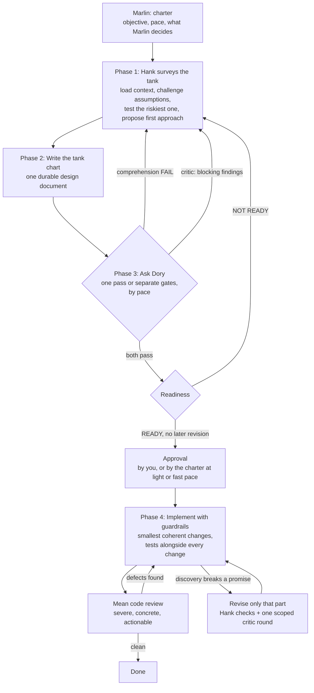

# HankNDory

**A structured design-validate-implement method for building software with an AI coding agent, named for three Pixar characters: Dory and Marlin, from *Finding Nemo*, and Hank, from its sequel, *Finding Dory*.**

This is version 2.1. [CHANGELOG.md](./CHANGELOG.md) lists what changed in each version.

HankNDory is an **[Agent Skill](https://agentskills.io/specification)**: a `SKILL.md` file (plus supporting reference material) that an AI coding agent loads and follows as an explicit workflow, instead of designing and coding a feature in one continuous, memory-biased conversation. It exists to stop a common failure mode of AI-assisted development: an agent (and the human driving it) becoming anchored to unstated assumptions that only ever lived in one long chat, producing a design that looks solid in the room but falls apart the moment someone (or something) reads it cold.

Because it follows the open Agent Skills standard rather than a vendor-specific format, it works unmodified across GitHub Copilot, Claude, Codex, Pi, OMP, DeepSeek Harness, OpenCode, Antigravity, and any other compliant agent. See [Installing the skill](#installing-the-skill) below.

## The problem this solves

When you design and implement a feature in one sitting with an AI agent, the agent's understanding of *why* each decision was made lives only in that conversation's context. Nothing forces the design to be written down completely enough to survive outside it. Gaps get papered over by continuity ("we already covered that") rather than caught, and by the time the flaw surfaces (in code review, in production, or in a teammate's confused questions), the reasoning that would explain or fix it is gone.

HankNDory forces a hard separation between **designing with full context** and **validating with none**, so that the design document itself, not the conversation that produced it, has to carry the full weight of the plan.

## The three characters

Dory, who debuted in *Finding Nemo*, and Hank, the septopus who appears in its sequel, *Finding Dory*, each lend their defining trait to one half of the method. Marlin, Nemo's dad, keeps the whole trip moving:

### Hank, the design phase

Hank is the wary, context-rich phase where a feature is actually designed. In this phase, the agent:

- inspects the real repository (existing code, architecture, tests, conventions) before proposing anything;
- proposes an initial technical approach itself, rather than waiting to be told one, to test its own understanding and avoid anchoring on the user's first idea;
- challenges assumptions, asks hard questions, and argues against a design that is merely agreeable rather than sound;
- runs a short, throwaway experiment first when a cheap real test can settle the riskiest assumption;
- refuses to let a single line of production code be written until the plan is validated;
- writes everything down into one durable design document: problem, goals, current system, architecture, alternatives considered and rejected, the contracts each component must keep and the build order, risks, rollout.

Hank plans like his freedom depends on it: nothing proceeds until the plan accounts for failure modes, edge cases, and the messy reality of the existing system.

### Dory, the validation phase(s)

Dory is the opposite of Hank by design: she has **no memory of the Hank conversation at all**. Every Dory phase must run in a fresh conversation with no history (never a continuation of the design conversation) because a single ongoing conversation cannot honestly certify its own amnesia. A sub-agent or a new chat in the same checkout is enough, as long as it starts with nothing from the design session. She needs a blank memory. She does not need a new copy of the repository. A Dory phase is handed nothing but the design document and the files it explicitly references, and must succeed or fail using only that.

There are three independent Dory checks, each a hard gate:

| Dory phase | Question it answers |
|---|---|
| **Comprehension** | Can a reader with zero prior context explain the problem, the current system, the proposed solution, and the parts that will change, using only the document? Does that explanation still hold up once rewritten in the plainest possible language, with nothing invented or lost? |
| **Critic** | Does the design have faulty assumptions, missing edge cases, contract or lifecycle gaps, or unresolved risks, reviewed adversarially? |
| **Readiness** | Does the document contain everything an implementer needs to build it correctly on the first pass, with no outstanding material questions? |

At careful pace, comprehension and critic run at the same time, both reading the same commit of the document, because neither needs the other's result, and readiness runs last, once both have passed. At faster paces one reviewer runs them in one pass, as the pace table below shows. Before a batch reviews a new version, Hank runs his own checks on it once: a mechanical scan and, once there is an earlier reviewed commit to compare with, a diff check that asks whether the revision fixed what it was meant to fix, brought back an old defect, contradicted unchanged text, or quietly changed an obligation. He fixes what they find, then starts the batch, to keep mistakes a fix just added away from reviewers.

A critic round with no blocking findings passes, and its important findings are fixed once, without another round. A design gets two or three critic rounds in its whole life, by pace, including any after building starts, and more need the user's OK.

If any Dory phase fails, work returns to Hank to fix the document, never to patch understanding verbally and move on. Only after the gates pass, and you approve, or the charter does at light or fast pace, does implementation begin.

### Marlin, the one who keeps swimming

Marlin crossed an ocean to find Nemo and never stopped to wait. In the method, Marlin is a role the main conversation plays, and Nemo is the final objective. At kickoff, you and Marlin write a short **charter**: the final objective, milestones, deadline, budget (in agent-hours, counting every agent that runs, or in cost), pace, which decisions Marlin makes alone, which ones stay with you, any wording or small extension you accept as built, where Marlin backs up the work, and how long a reversible question waits before Marlin takes its default (10 minutes unless you set another). After that, Marlin:

- decides what the charter hands over, and records it;
- sends you one **digest** at a time, holding every question and every piece of news, each question with a recommendation and, where it can be undone, a default and when it takes effect;
- keeps working on whatever no pending answer can change, instead of sitting idle;
- tells you early when the deadline or budget is at risk, and never recommends another review round when nothing is blocking;
- pushes the designs, the charter, their history files, and the working branches to a backup remote at every gate, so losing a machine loses nothing. If the project's repository is public or isn't yours, use a private one.

The charter also sets the **pace**:

| Pace | Dory review | Approval before building |
|---|---|---|
| **Light** | for a point release or a design written after the code: one fresh reviewer runs every gate in one pass, Hank fixes everything it found once, design and code, and checks the fix; a second pass runs only if the first had a blocking finding, a failed comprehension test, or a not-ready verdict; one code review plus one re-review; needs a design-review budget cap | the charter approves the fixed version once the last pass had none of those |
| **Fast** | one fresh reviewer runs every gate in one pass; two critic rounds in the design's life; building overlaps review | the charter approves a `READY` design that stays inside it |
| **Balanced** | one fresh reviewer runs comprehension, clarity, and critic, then a separate readiness check; two critic rounds | you approve, possibly through the digest |
| **Careful** | separate reviewers for each gate, as above; three critic rounds | you approve |

Anything on the skill's "Always standard" list (public APIs or schemas, auth, migrations or deletions of user or production data, billing, security boundaries, cross-team contracts) runs at careful pace unless the charter names it. Without a charter, everything runs at careful pace. At light and fast pace, reviewers run at Hank's reasoning effort unless the charter asks for more.

**Tooling note for the GitHub Copilot app:** task sub-agents there see the parent session's checkpoint titles and file list, so they can't be certified as fresh for a Dory review. Run each Dory reviewer as a new top-level session that doesn't pause for plan approval, and archive it once it returns. A sub-agent is fine for the mean code review, which doesn't need a blank memory.

## The full lifecycle



1. **Phase 1: Hank surveys the tank.** Load and verify real repository context, enforce a strict no-production-code rule during discovery, apply an explicit "sycophant challenge" (state the strongest counter-argument, find the weakest evidence), test the riskiest assumption with a short throwaway spike when a cheap test can settle it, then propose a first technical approach before asking the user for one.
2. **Phase 2: Write the tank chart.** Turn the discussion into one markdown design document, built section by section from a fixed template (`reference/design-doc-template.md`) covering problem, goals, current system, architecture, alternatives considered, detailed implementation, risks, rollout, and a one-line-per-review `Dory validation record`. The design states the promises the code must keep, such as contracts, invariants, and the build order, not the code itself, and it has a length limit. Each rule is written once and referred to by name everywhere else, and the revision and review history lives in a separate history file, while decisions and rejected alternatives stay in the design. Before handing off to Dory, Hank runs a plain-speech pass over the prose sections against `reference/plain-speech-checklist.md`.
3. **Phase 3: Ask Dory.** At careful pace, run the comprehension and critic checks at the same time, each in its own fresh conversation, both reading the same commit of the document, after one pass of Hank's own checks (`reference/hank-checks.md`), and run readiness once both pass. At balanced and fast pace, one fresh reviewer runs the gates in one pass, and fast pace skips Hank's diff check. Any failure sends the work back to Hank with a specific, actionable gap list, and Hank fixes everything from one batch in a single revision, written in a new conversation that picks up from a handoff entry in the history file, so Hank's conversation stays short through the review loop. A critic round with no blocking findings passes, and a design gets two or three critic rounds in its whole life, by pace. Every reviewer runs on a model at least as capable as Hank's. Any reviewer that runs the critic or readiness review runs at Hank's reasoning effort or higher. A reviewer that runs only the comprehension test, and Hank's diff check, may run lower, but not below high or the tooling's nearest equivalent, or at Hank's effort if Hank runs below high.
4. **Phase 4: Implement with guardrails.** Only after approval, or at light or fast pace on parts no blocking finding touches, implement the smallest coherent units from the approved plan, with tests alongside every change. A discovery that keeps the design's promises is the implementer's call, logged in one line. One that breaks a promise revises only that part of the design, which gets Hank's checks and one scoped critic round, or a scoped pass at fast pace, instead of restarting the whole review. Finish with a severe but constructive "mean" code review against the approved design. After the first round, re-reviews read the fix diff, unless a fix touched a shared contract.

A **bootstrap-context** mode is also available for onboarding an existing, under-documented codebase: it recursively generates and rolls up `README.md` files from the leaves of the source tree upward, so a later Hank phase has real material to load instead of starting cold.

## Operating modes

| Mode | Purpose |
|---|---|
| `new-feature-hank` | Co-design a new feature and produce or improve its design document. |
| `dory-comprehension` | Test whether a fresh reader can understand the feature from the document alone, including a plain-language rewrite check. |
| `dory-critic` | Adversarially review the design for omissions, faulty assumptions, and risk. |
| `dory-readiness` | Decide whether the document is sufficient for a correct first-pass implementation. |
| `dory-pass` | At balanced, light, or fast pace, run the Dory gates the pace names in one fresh conversation. |
| `implementation` | Implement strictly from an approved, validated design document. |
| `mean-review` | Perform a severe, actionable code review against the approved design. |
| `bootstrap-context` | Build a hierarchy of repository README files via bottom-up summarization. |
| `full-voyage` | Orchestrate every phase above, in order, end to end, with Marlin keeping it moving toward the final objective. |

Not every job needs the full method. Trivial changes (a copy fix, a log line, an isolated one-file bug fix) skip straight to a direct edit plus tests and a code review. One-off operations (a download, a conversion, a test run, a publish, a one-time cleanup) get a one-page checklist and a review of any script instead. Anything touching public APIs, schemas, auth, migrations or deletions of user or production data, billing, security boundaries, or cross-team contracts always gets the full method.

## Installing the skill

The entire skill lives in the [`hankndory/`](./hankndory) folder of this repository. Every agent below loads a skill the same way: the folder is copied (or symlinked) into that agent's skills directory, keeping the folder itself named `hankndory`, matching the `name:` field in its frontmatter, as the Agent Skills spec requires.

### Quick install (GitHub CLI)

If you have [GitHub CLI](https://cli.github.com/) 2.90.0 or later, this installs into the correct directory for whichever host you run it from, automatically:

```sh
gh skill install ajaxdude/HankNDory
```

Pass `--agent <host> --scope <user|project>` to target a specific agent/location instead of the interactive prompt, e.g. `gh skill install ajaxdude/HankNDory --agent claude-code --scope user`.

Without a version, `gh skill install` installs the latest tagged release. To pin one, name it: `gh skill install ajaxdude/HankNDory hankndory@v2.1`, or pass `--pin v2.1`. `gh skill update hankndory` moves an unpinned install to the newest release and skips pinned installs unless you add `--unpin`.

### Manual install, by agent

| Agent | Personal (all projects) | Project (this repo only) |
|---|---|---|
| **GitHub Copilot / Copilot CLI** | `~/.copilot/skills/hankndory/` or `~/.agents/skills/hankndory/` | `.github/skills/hankndory/`, `.claude/skills/hankndory/`, or `.agents/skills/hankndory/` |
| **Claude / Claude Code** | `~/.claude/skills/hankndory/` | `.claude/skills/hankndory/` |
| **Codex (ChatGPT & Codex CLI)** | `~/.codex/skills/hankndory/` | `.codex/skills/hankndory/` |
| **Pi** | `~/.pi/agent/skills/hankndory/` or `~/.agents/skills/hankndory/` | `.pi/skills/hankndory/` or `.agents/skills/hankndory/` |
| **OMP** | Reads Claude-compatible skills directly. Install the same way as Claude Code, above | same as Claude Code, above |
| **DeepSeek Harness (`dsh`)** | `~/.dsh/skills/hankndory/` or `~/.agents/skills/hankndory/` | `.dsh/skills/hankndory/` or `.agents/skills/hankndory/` |
| **OpenCode** | `~/.config/opencode/skills/hankndory/`, `~/.claude/skills/hankndory/`, or `~/.agents/skills/hankndory/` | `.opencode/skills/hankndory/`, `.claude/skills/hankndory/`, or `.agents/skills/hankndory/` |
| **Antigravity** | `~/.gemini/config/skills/hankndory/` | `.agents/skills/hankndory/` (default) or `.antigravity/skills/hankndory/` |

Two things fall out of this table worth calling out directly:

- **`~/.agents/skills/` (personal) and `.agents/skills/` (project) are a shared, tool-agnostic convention** that several of these agents read directly: Copilot, Pi, OpenCode, Antigravity, and DeepSeek Harness. Installing HankNDory there once can cover multiple agents at once instead of duplicating the folder per tool.
- **DeepSeek Harness** (`dsh`, [deepseek-ai/deepseek-harness](https://github.com/deepseek-ai/deepseek-harness)) discovers skills through its `skill-filesystem` provider, which requires the same one-level `<name>/SKILL.md` layout this repository already uses. No restructuring needed. Its own docs note the project is in developer preview with compatibility-breaking changes expected, so these paths may shift.
- **"OMP"** isn't yet an independently-documented Agent Skills client as of this writing; it's listed here because it's known to read Claude-compatible skills/plugins without requiring Claude Code itself. If it refers to something more specific, the fallback is the same either way: any client that follows the Agent Skills spec will find HankNDory wherever it expects skills to live, since the format itself is what's portable.

Once installed, the skill is discovered by its frontmatter `name` (`hankndory`) and `description`, so it activates automatically whenever a request matches, or it can be invoked explicitly, e.g. *"use HankNDory to design the new export feature."*

To see which version an agent has, check the title line of its installed `SKILL.md` or the `metadata.version` field in its frontmatter. Agents that follow the skill also report the version in their phase status, which makes a stale install easy to spot.

## Repository layout

```
HankNDory/
├── CHANGELOG.md
├── LICENSE
├── README.md
└── hankndory/
    ├── SKILL.md
    ├── agents/
    │   └── ui_metadata.yaml
    └── reference/
        ├── bootstrap-context.md
        ├── design-doc-template.md
        ├── hank-checks.md
        ├── hank-handoff.md
        ├── marlin.md
        ├── one-off-checklist.md
        └── plain-speech-checklist.md
```

- **`CHANGELOG.md`**: what changed in each version, newest first.
- **`hankndory/SKILL.md`**: the method itself, covering rules, modes, the charter and pace, the four-phase lifecycle, the design document structure, and the failure-recovery guidance the agent follows.
- **`hankndory/agents/ui_metadata.yaml`**: display metadata (name, one-line description) used by tooling that surfaces installed skills in a UI.
- **`hankndory/reference/bootstrap-context.md`**: the steps the `bootstrap-context` mode follows, kept out of `SKILL.md` to keep it short.
- **`hankndory/reference/design-doc-template.md`**: the canonical starting template for every design document the Hank phase produces, with per-section guidance comments.
- **`hankndory/reference/hank-checks.md`**: the mechanical scan and the diff check Hank runs once on each new version before Dory reviews it.
- **`hankndory/reference/hank-handoff.md`**: how Hank hands the review loop to a new conversation after each batch, so its conversation stays short.
- **`hankndory/reference/marlin.md`**: the charter, how Marlin sorts decisions, and the digest that replaces one-at-a-time questions.
- **`hankndory/reference/one-off-checklist.md`**: the one-page checklist used instead of the design method for a one-off operation, such as a download or a one-time cleanup.
- **`hankndory/reference/plain-speech-checklist.md`**: the checklist Hank applies to prose sections at the end of Phase 2, adapted from the [unslop](https://github.com/cursor/plugins/blob/main/pstack/skills/unslop/SKILL.md) skill for design-document writing.
- **`hankndory/`** is deliberately nested one level below the repository root (rather than living at the root itself) because `gh skill` and several other skill-discovery tools only scan for `*/SKILL.md`, not a `SKILL.md` at the very top of a repository.

## Why this matters in practice

The method's core discipline is simple to state and easy to skip under time pressure: **a design is not done because the room agrees on it; it is done because a stranger with no memory of the room can read it and build the right thing.** Hank brings the context and the caution. Dory brings the amnesia that keeps everyone honest. Marlin keeps everyone swimming toward Nemo.

## License

[MIT](./LICENSE). © 2026 CostePartners.com. Use, copy, modify, and redistribute freely, including in commercial and closed-source projects, provided the copyright notice is retained.
